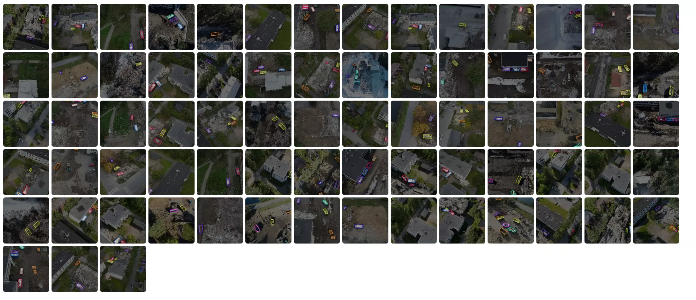
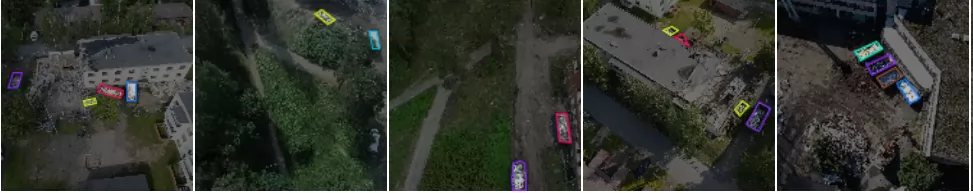
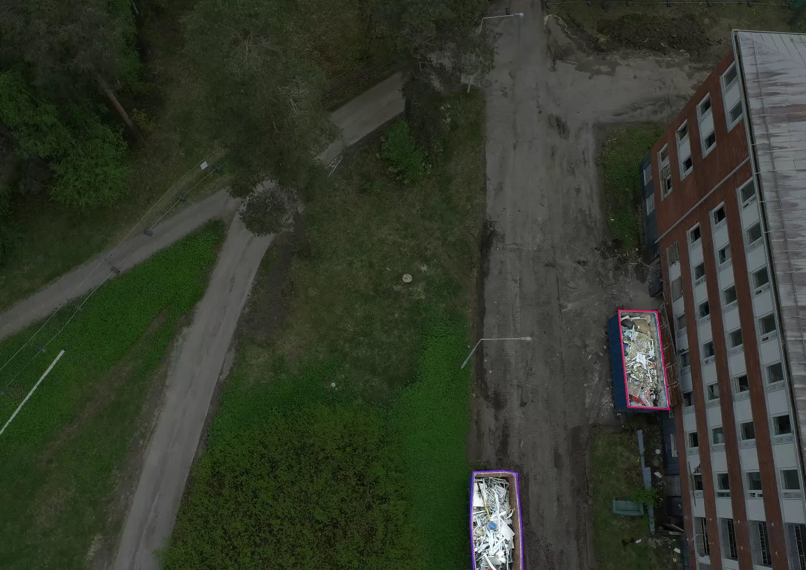
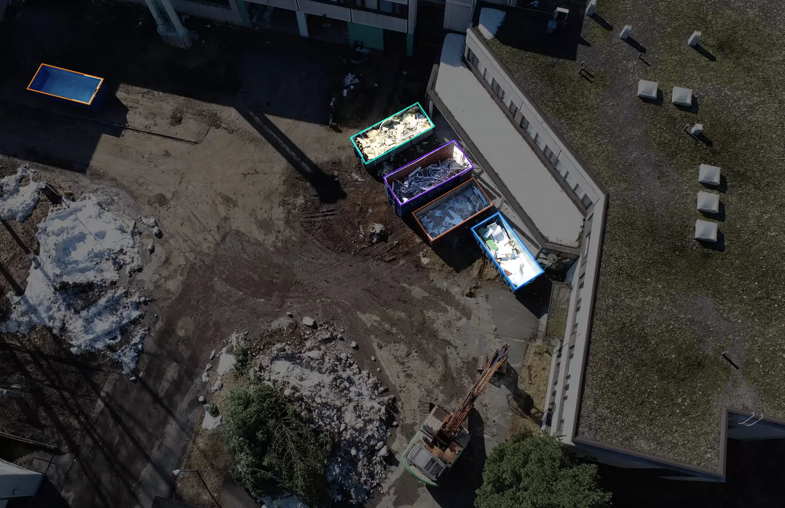
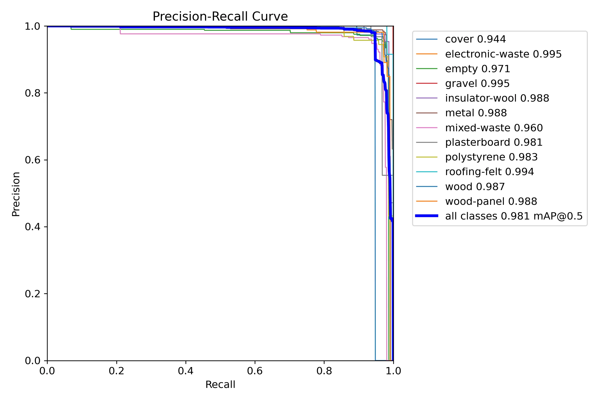
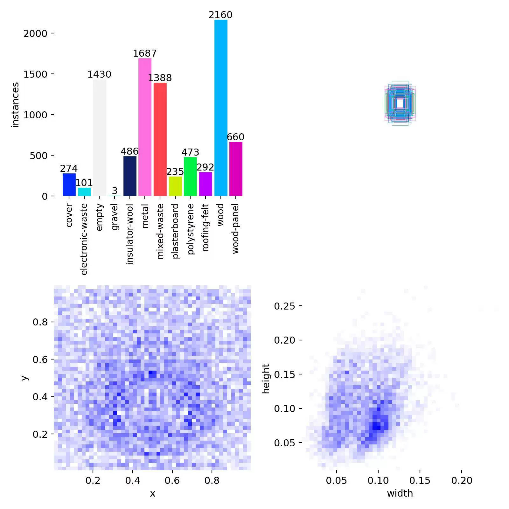
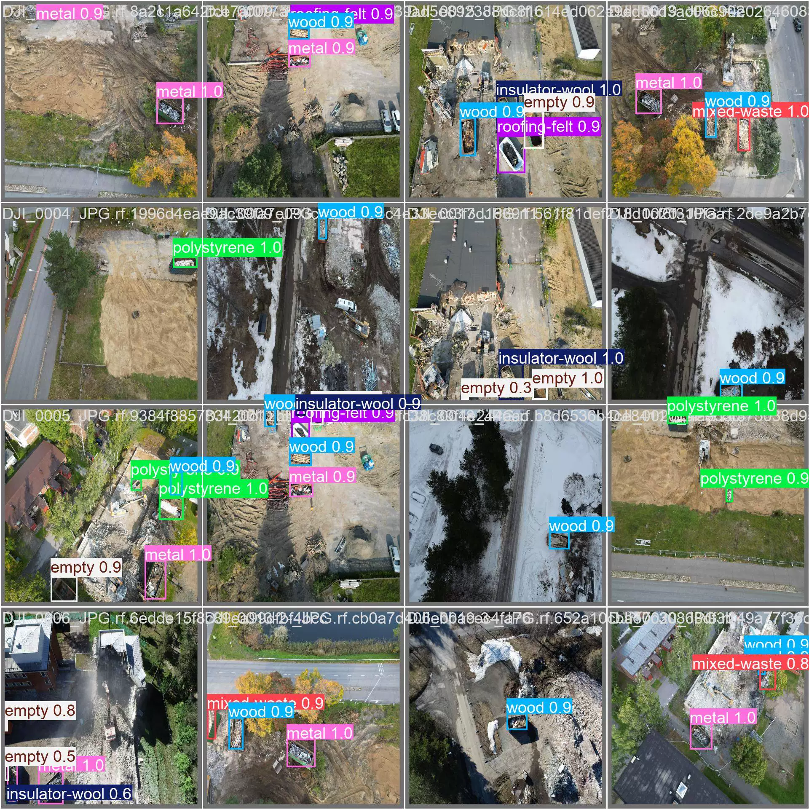
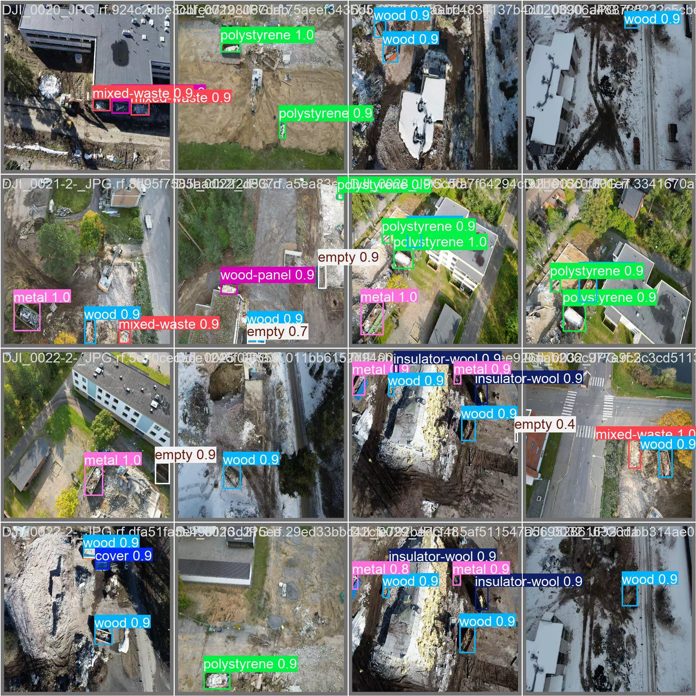
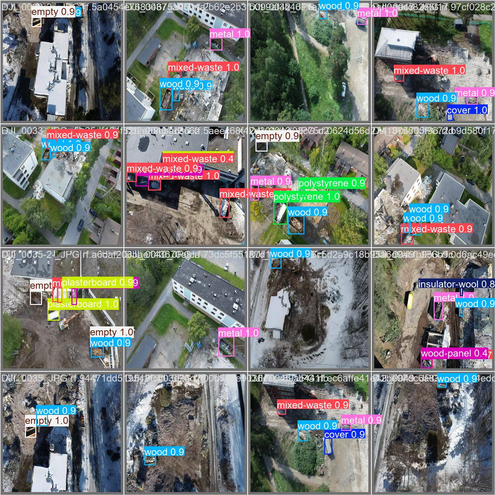

## Body

UAV High Altitude   Building Waste Target Recognition YOLO Format

Totally 3382 images, each labeled properly, and training set, test set, validation set have been divided.
12 categories are included, which are 'cover', 'electronic-waste', 'empty', 'gravel', 'insulator-wool', 'metal', 'mixed-waste', 'plasterboard', 'polystyrene', 'roofing-felt', 'wood', 'wood-panel'

'Cover', 'Electronic Waste', 'Empty', 'Gravel', 'Insulator-Wool', 'Metal', 'Mixed Waste', 'Plasterboard', 'Polystyrene', 'Roofing Felt', 'Wood', 'Wood Panel'

YOLOv8s Object Detection Weight File (Training rounds 100, pre-trained model YOLOv8s.pt, mAP@0.5 0.981) with the result file of training

Electronic Virtual Products Sold Without Return or Exchange

## Images

Here is a pay link on Stripe ( https://buy.stripe.com/3cs8yP7sY87d0vu9AB ). Please contact me lonlonago@foxmail.com after funding $89, and I will send you a complete data files , thank you!

